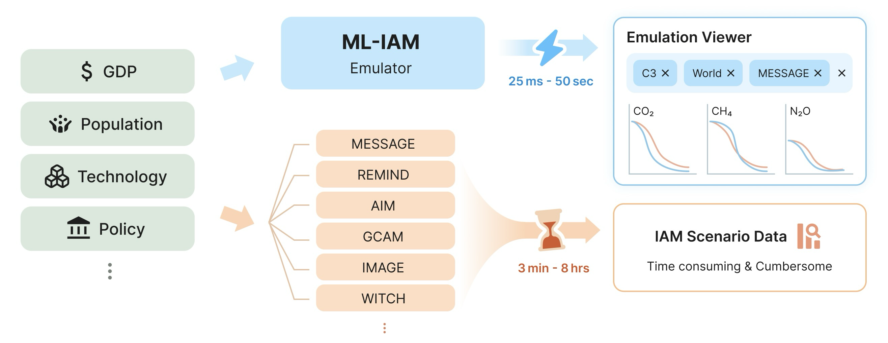
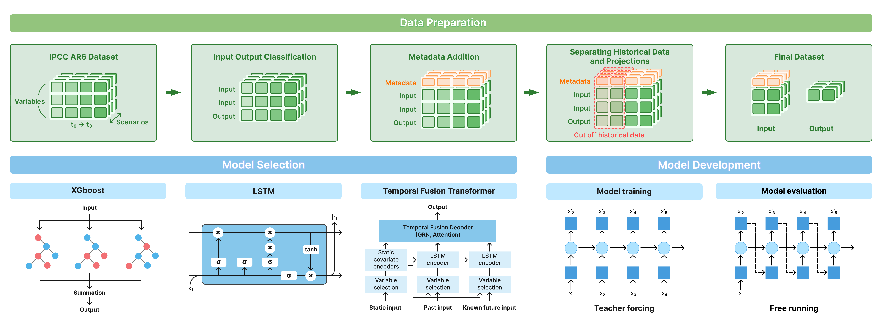

# ML-IAM v1.0: Machine Learning for Integrated Assessment Model Emulation

**A reproducible pipeline for emulating IAM scenario time-series using gradient boosted trees and deep learning.**

📄 [**Preprint**](https://egusphere.copernicus.org/preprints/2026/egusphere-2025-5305/) | 🌐 [**Emulation Viewer**](https://mliam.dev/) | [](https://doi.org/10.5281/zenodo.17390677)

---

## 🎯 What are you looking for?

<table>
<tr>
<td width="50%">

### 🔍 **Try out ML-IAM**
Want to explore emulated IAM scenarios without coding?

👉 **[Visit the Emulation Viewer](https://mliam.dev/)**

Interactive web interface to visualize and compare emulated climate policy scenarios.

</td>
<td width="50%">

### 🔧 **Train your own models**
Researcher looking to replicate or extend this work?

👉 **First**: [Download AR6 data](#-prerequisites) (required for all paths)

👉 **Then: Quick start (XGBoost, <1 hour)**: [Quick Training](#-quick-training-xgboost)

👉 **Or: Full pipeline (LSTM/TFT)**: [Advanced Training](#-advanced-training-lstmtft)
</td>
</tr>
</table>

---

## 📖 What is ML-IAM?



Integrated Assessment Models (IAMs) are crucial for climate policy analysis but computationally expensive to run. ML-IAM provides fast, accurate emulation of IAM scenarios using machine learning, enabling:
- 🚀 **Rapid scenario exploration** (seconds vs. hours/days)
- 🔄 **Sensitivity analysis** at scale



We train three model architectures on IPCC AR6 scenario data:
- **XGBoost**: Gradient boosted trees (fastest, interpretable)
- **LSTM**: Long short-term memory networks (sequential patterns)
- **TFT**: Temporal Fusion Transformer (transformer-based temporal modeling)

---

## 📊 Prerequisites

### Download AR6 Data

This pipeline requires the **IPCC AR6 Scenario Explorer Database (v1.1)**:

1. Visit the [AR6 Scenario Explorer](https://data.ene.iiasa.ac.at/ar6/) *(You can download without creating an account by clicking “Guest login”.)*
2. Download the following files:
  - `AR6_Scenarios_Database_ISO3_v1.1.csv`
  - `AR6_Scenarios_Database_R6_regions_v1.1.csv`
  - `AR6_Scenarios_Database_R5_regions_v1.1.csv`
  - `AR6_Scenarios_Database_R10_regions_v1.1.csv`
  - `AR6_Scenarios_Database_World_v1.1.csv`

3. Place files in your raw data directory (e.g., `/path/to/ar6/data/`)

**⚠️ License & Citation:** The AR6 data is subject to [IIASA's license terms](https://data.ene.iiasa.ac.at/ar6/#/license).

---

## ⚡ Quick Training (XGBoost)

**Time required:** ~45 minutes | **Hardware:** CPU only (GPU is optional)

### Step 1: Clone Repository & Install Dependencies

```bash
# Clone repository
git clone https://github.com/YenShin1891/ml-iam.git
cd ml-iam

# Create virtual environment (Python 3.9)
conda create -n ml-iam python=3.9
conda activate ml-iam
# If you don't have conda, install Miniconda or Anaconda first: https://docs.conda.io/en/latest/miniconda.html

# Install dependencies
pip install -r requirements.txt
```

### Step 2: Configure Paths

First, create your local paths config from the template:

```bash
cp configs/paths-template.py configs/paths.py
```

Then open `configs/paths.py` and update the paths for:
- `RAW_DATA_PATH` – where you saved the AR6 CSVs
- `DATA_PATH` – where you want the processed data saved
- `RESULTS_PATH` – where you want the model outputs saved

### Step 3: Process Data

Run the data processing pipeline:

```bash
make process-data
```

*This command uses `configs/paths.py` and `configs/data.py` under the hood.*

This command:
- Loads raw AR6 CSVs from `RAW_DATA_PATH`
- Joins metadata (variable classification and scenario categories)
- Selects input/output variables using `OUTPUT_VARIABLES` and `MIN_COUNT`
- Normalizes units and reshapes to a year-indexed wide table
- Optionally filters out pre-base-year rows when `"apply-base-year"` is in `TAGS`
- Applies row-level completeness filtering using `COMPLETENESS_RATIO`
- Writes a versioned dataset (`processed_series.csv`) and analysis files under `DATA_PATH/<version_name>`

**Key knobs** (in `configs/data.py`):
- `OUTPUT_VARIABLES`: Variables the models will learn to predict
- `MIN_COUNT`: Minimum occurrences required to keep a variable
- `COMPLETENESS_RATIO`: Fraction of non-missing variables required to keep a row
- `TAGS`: Extra behaviors (e.g. `"include-intermediate"`, `"apply-base-year"`)

### Step 4: Create a Run Config

All training is driven by a YAML run config. Copy an example and edit it:

```bash
cp configs/runs/xgb_example.yaml configs/runs/my_run.yaml
```

Example configs are provided for each model under `configs/runs/`.

**Run config fields:**

| Field | Description |
|---|---|
| `model` | `xgb`, `lstm`, or `tft` |
| `phases` | Phases to run, e.g. `[preprocess, search, train, test, plot]`. `preprocess` must be included for new runs. Omit `search` to use default hyperparameters. |
| `dataset` | Processed dataset subdirectory name under `DATA_PATH` |
| `cuda_visible_devices` | `default` for all phases, override `search` for multi-GPU (e.g. `{default: "0", search: "0,1,2,3"}`) |
| `note` | Free-text note saved with the run |
| `lag_required` | Whether full lag history is required (LSTM/TFT) |
| `two_window` | Use two-window prediction (TFT only) |
| `run_id` | Existing run ID to resume (e.g. `tft_01`). Required when using `resume`. |
| `resume` | Phase to resume from: `preprocess`, `search`, `train`, `test`, or `plot`. Runs only that single phase using the existing run's data/config. |

**Resuming an existing run:**

To re-run a specific phase of a completed (or partially completed) run, add `run_id` and `resume` to your config:

```yaml
model: tft
run_id: tft_01
resume: test          # re-run only the test phase
```

Then launch as usual with `make train RUN=...`.

### Step 5: Train

```bash
make train RUN=configs/runs/my_run.yaml

# Or run in the background (logs + pidfile under ./logs/)
make train-bg RUN=configs/runs/my_run.yaml
```

**Outputs** (saved to `./results/<model>/[run_id]/`):
- Logs
- Trained model
- Performance metrics (RMSE, MAE, R²)
- Visualizations & SHAP explainability plots

**Next steps:** See [Understanding Results](#-understanding-results) for interpretation.

---

## 🚀 Advanced Training (LSTM/TFT)

**Time required:** 4-12 hours | **Hardware:** GPU recommended (CUDA 11.6+)

**If you haven’t already completed the Quick Training setup:**
1. Complete [Steps 1-3 from Quick Training](#-quick-training-xgboost) (clone, install, configure, process data)
2. Then return here for GPU-specific setup

### Install additional Python dependencies (LSTM/TFT)

Install the extra Python packages needed for LSTM/TFT on top of the quick-start environment:

```bash
pip install -r requirements-advanced.txt
```

Verify PyTorch CUDA availability:
```bash
python -c "import torch; print(f’CUDA available: {torch.cuda.is_available()}’)"
```

### Training LSTM / TFT

Same workflow as XGBoost — edit a config and run:

```bash
make train RUN=configs/runs/lstm_example.yaml
make train RUN=configs/runs/tft_example.yaml
```

### Background training

```bash
make train-bg RUN=configs/runs/lstm_example.yaml
```

This creates a timestamped log and pidfile under `./logs/`. Training continues even if you close the terminal.

If you already started training in the foreground: `Ctrl+Z` → `bg` → `disown`.

---

## ⚙️ Configuration

All configuration is centralized in the `configs/` directory. You can tweak the settings to match your preference.

### Data Processing Configurations (`configs/data.py`)
Key parameters:
```python
OUTPUT_VARIABLES = [
    'Emissions|CO2',
    'Primary Energy|Coal',
    # ... more targets
]

MAX_YEAR = 2100  # Upper year limit
N_LAG_FEATURES = 3  # Number of lagged timesteps
```

### Model Hyperparameters
- **XGBoost**: `configs/models/xgb.py` (training) and `configs/models/xgb_search.py` (search space)
- **LSTM**: `configs/models/lstm.py`
- **TFT**: `configs/models/tft.py` and `configs/models/tft_search.py`

---

## 📈 Understanding Results

### Output Structure

After training, results are organized as:
```
results/
├── xgb/
│   └── [run_id]/
│       ├── models/              # Trained XGBoost models per variable
│       ├── predictions/         # Test set predictions
│       ├── metrics.json         # Performance metrics (RMSE, MAE, R²)
│       └── plots/               # Visualizations & SHAP plots
├── lstm/
│   └── [run_id]/
│       └── ...
└── tft/
    └── [run_id]/
        └── ...
```

### Visualizations

Generated plots include:
1. **Predicted vs Actual scatter plots** (per variable)
2. **Trajectory comparisons** (model predictions vs IAM scenarios)
3. **SHAP explainability plots** (feature importance over time)

---

## 🎨 Explore Your Results

Launch the interactive Streamlit page to explore results:

```bash
streamlit run scripts/dashboard.py
```

Access at `http://localhost:8501`

**Features (WIP):**
- Compare predictions across models
- Visualize scenario trajectories
- Explore feature importance

---

## ❓ FAQ

### Can I use pre-trained models for inference?

Currently, we do not provide pre-trained models for direct inference. To use ML-IAM, you need to train models yourself using the pipeline. We may release pre-trained models in the future.

**For now:**
- Use the [Emulation Viewer](https://mliam.dev/) to explore pre-computed scenarios
- Train models yourself following the [Quick Training](#-quick-training-xgboost) guide

### How do I add new target variables?

1. Edit `configs/data.py` and add to `OUTPUT_VARIABLES`:
   ```python
   OUTPUT_VARIABLES = [
       'Emissions|CO2',
       'Your|New|Variable',  # Add here
   ]
   ```
2. Re-run data processing: `make process-data`
3. Retrain models

---

## 📚 Citation

```bibtex
@article{egusphere-2025-5305,
AUTHOR = {Shin, Y. and Lee, C. and Kim, E. and Myung, J. and Park, K. and Ha, J. and Choi, M.-Y. and Kim, B. and Ka, H. W. and Woo, J.-H. and Oh, A. and McJeon, H.},
TITLE = {ML-IAM v1.0: Emulating Integrated Assessment Models With Machine Learning},
JOURNAL = {EGUsphere},
VOLUME = {2026},
YEAR = {2026},
PAGES = {1--24},
URL = {https://egusphere.copernicus.org/preprints/2026/egusphere-2025-5305/},
DOI = {10.5194/egusphere-2025-5305}
}
```

---

## 📄 License

This code is released under [`LICENSE`](LICENSE). The AR6 data used by this pipeline has its own separate license and must be obtained and used in compliance with the [IIASA AR6 license](https://data.ene.iiasa.ac.at/ar6/#/license).